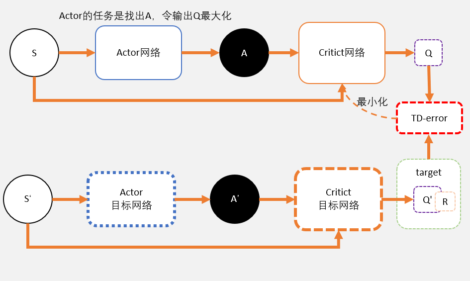

# 深度强化学习

其他：
- AlphaGo
- AlphaGo Zero | AlphaZero
- MuZero
- CRM  

教程

[1] 十分钟强化学习系列: https://www.bilibili.com/video/BV1Yg4y1y7i2/?p=11&spm_id_from=pageDriver
Code: https://github.com/afirez/Ten_Minute_RL

[2] 深入浅出解读并思考AlphaGo: https://zhuanlan.zhihu.com/p/352661568
[3] David Silver强化学习总体介绍-初步搭建强化学习理论体系(一) ： https://zhuanlan.zhihu.com/p/299592209
[4] David Silver强化学习核心之马尔科夫决策过程理论与实战(二) ：https://zhuanlan.zhihu.com/p/325782404
[5] David Silver强化学习之动态规划寻找最优策略理论与实战(三) ：https://zhuanlan.zhihu.com/p/333661254
[6] David Silver强化学习之蒙特卡洛学习,时序差分学习理论与实战(四) ：https://zhuanlan.zhihu.com/p/335513625
[7] David Silver强化学习之不基于模型的控制(五) ： https://zhuanlan.zhihu.com/p/339785566

[8] 强化学习（二）——无模型环境的评估与控制: https://blog.csdn.net/kmzy_hnu/article/details/115552149
[9] 强化学习（三）——价值函数近似: https://blog.csdn.net/kmzy_hnu/article/details/115583106

参考

[1] AlphaZero

[2] AlphaZero实战：从零学下五子棋（附代码）: https://zhuanlan.zhihu.com/p/32089487

https://github.com/junxiaosong/AlphaZero_Gomoku

[3] Easy as ABCs: Unifying Boltzmann Q-Learning and Counterfactual Regret
Minimization: https://arxiv.org/pdf/2402.11835.pdf

CRM

[4] Deep Reinforcement Learning for Portfolio Management: https://arxiv.org/ftp/arxiv/papers/2012/2012.13773.pdf

[5] 强化学习与股票投资组合 《Optimistic Bull or Pessimistic Bear: Adaptive Deep Reinforcement Learning
for Stock Portfolio Allocation》: https://arxiv.org/pdf/1907.01503.pdf
DDPG介绍可参考资料：https://zhuanlan.zhihu.com/p/111257402
源代码可参考：https://github.com/YinchuanLl/Reinforcement-learning-for-portfolio-allocation

[5] minizero : https://github.com/rlglab/minizero

[6] 五子棋 NickNameHaveBeenSwallowed/muzero-tensorflow2.x : https://github.com/NickNameHaveBeenSwallowed/muzero-tensorflow2.x

https://blog.csdn.net/weixin_41369892/article/details/126102213

[7] 五子棋 junxiaosong/AlphaZero_Gomoku ：https://github.com/junxiaosong/AlphaZero_Gomoku
## 相关

### MDP ( Model-Based | Model-Free)

- MDP 马尔可夫决策过程
- MRP 马尔科夫奖励过程
- 贝尔曼期望方程
- 贝尔曼最优方程
- State 状态空间
- Action 动作行为空间
- Pi(s) 策略网络
- V(s) 状态价值网络
- Q(s, a) 状态行为价值网络
  
### 策略评估、策略迭代、价值迭代

- 策略评估
- 策略迭代
- 价值迭代
- 基于策略
- 基于价值
- 基于模型
- 用神经网络代替策略，价值，模型？

### DP、MC、TD | n-step TD

- DP
- MC
- TD | n-step TD
- Model-Based | Model-Free
- On-Policy | Off-Policy

### 策略网络、价值网络、MCTS、模型网络

- 策略网络：在当前状态 S 下采用行为 A 的依据
  - 确定策略：a =π（s）
  - 随机策略：π（a|s）= P[a|s]
- 价值网络：评估当前状态的价值
  - V(s) 状态价值网络
  - Q(s, a) 状态行为价值网络
- MCTS ：蒙特卡洛搜索树
- 模型网络：输入为状态 S 的隐状态和应为 A ，输出为下一个状态 S_t+1 的隐状态, 状态 S 的隐状态是由表征网络得到的
- AlphaGo
- AlphaGo Zero | AlphaZero
- MuZero
- 自我对抗 （FSP：Fictitious Self-Play）

### RL 模型

- DQN : TD，连续状态空间问题，经验回放缓冲区，Off-Policy
- PG ：MC
- A2C ：TD ，TD 版 PG，策略网络，价值网络，On-Policy
- PPO ：TD（n），AC 架构，连续动作型问题, 随机策略， 稳定更新 actor ， 重要性采样，使用重要性采用将 AC 的 On-Policy 变为 Off-Policy? , 局部 Off-Policy?
- DDPG ：TD ，AC 架构，连续控制型问题，确定策略， Off-Policy

- TD3 ：TD 

- A3C
- DPPO