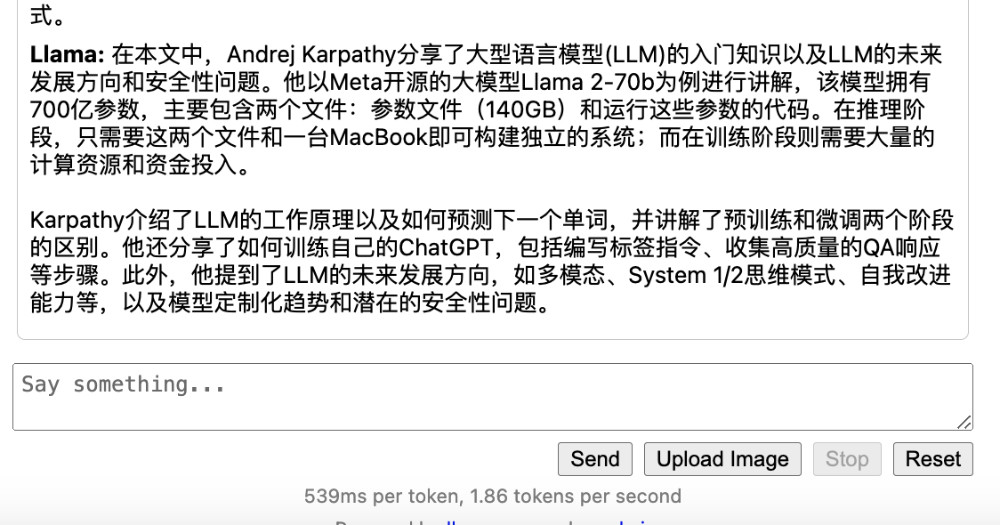
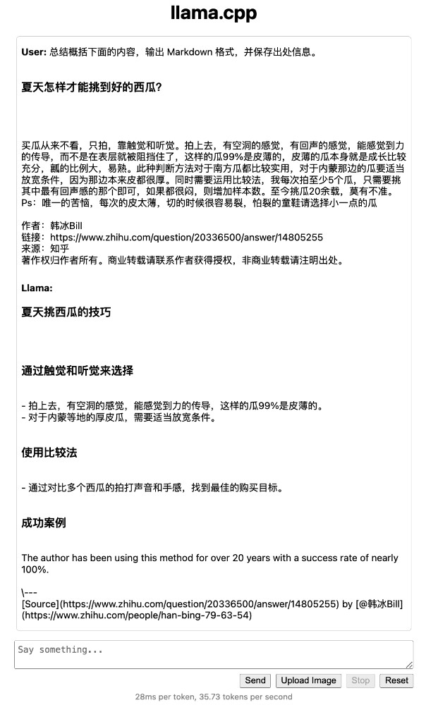

# Yi 34B

## Install

### Docker 安装 pytorch，transformers，huggingface-hub，hf_transfer

1 docker/Dockerfile

```yaml
FROM nvcr.io/nvidia/pytorch:23.10-py3

RUN pip config set global.index-url https://pypi.tuna.tsinghua.edu.cn/simple && \
    pip3 install --upgrade pip  # enable PEP 660 support

RUN sed -i 's/archive.ubuntu.com/mirrors.tuna.tsinghua.edu.cn/g' /etc/apt/sources.list && \
	sed -i 's/security.ubuntu.com/mirrors.tuna.tsinghua.edu.cn/g' /etc/apt/sources.list
    
WORKDIR /app

RUN pip3 install transformers==4.35.0 huggingface-hub==0.17.3 hf_transfer==0.1.4

RUN apt-get update && apt-get install cmake -y && apt-get autoremove -y
```

2 build

```bash
docker build -t afirezd/llm-yi-34b:v0.1 .
```

```yaml
version: '3'
services:
  llm-yi-34b:
    image: afirezd/llm-yi-34b:v0.1
    build:
      context: .
      dockerfile: ./docker/Dockerfile
```

```bash
docker-compose -f docker-compose-build.yaml up -d
```

3 run

```bash
docker run --rm -it -p 8080:8080 --gpus all --ipc=host --ulimit memlock=-1 -v `pwd`:/app afirezd/llm-yi-34b:v0.1 bash
```

```yaml
version: '3'
services:
  llm-yi-34b:
    image: afirezd/llm-yi-34b:v0.1
    runtime: nvidia
    ports:
      - "8080:8080"
    ipc: host
    ulimits:
      memlock: -1
    volumes:
      - .:/app
    stdin_open: true
    tty: true
    command: bash
```

```bash
docker-compose -f docker-compose.yaml up -d
```

进入容器
```bash
docker-compose exec llm-yi-34b bash
```

查看 显卡状态
```bash
# docker 容器中能运行
nvidia-smi

```

查看 nvcc, 编译 llama.cpp 需要 nvcc 是可用的

```bash
# docker 容器中能运行， 测试时 wsl2 linux 中不能
nvcc --version
```

## Yi-34B 模型

### 下载合适的模型文件

- [01-ai/Yi-34B](https://huggingface.co/01-ai/Yi-34B)
- [TheBloke/Capybara-Tess-Yi-34B-200K-DARE-Ties-GGUF](https://huggingface.co/TheBloke/Capybara-Tess-Yi-34B-200K-DARE-Ties-GGUF)
- [NousResearch/Nous-Capybara-34B](https://huggingface.co/NousResearch/Nous-Capybara-34B)

如果你想快速下载可靠的模型，可以使用下面的命令:

```bash
# 我们可以使用 Huggingface Cli 来下载模型
huggingface-cli download --resume-download --local-dir-use-symlinks False ${模型在huggingface上的名字} ${模型文件名}.gguf --local-dir ${模型存储路径}

# 你也可以使用下面的命令，通过社区用户搭建的减速器来下载
HF_ENDPOINT=https://hf-mirror.com HF_HUB_ENABLE_HF_TRANSFER=1 huggingface-cli download --resume-download --local-dir-use-symlinks False ${模型在huggingface上的名字} ${模型文件名}.gguf --local-dir ${模型存储路径}
```

这里测试选择的是 The Bloke 提供的开源模型，分别选择了 Q4 和 Q5 两个尺寸的量化模型，这两个模型有一个有趣的差异，一个恰好放的进 24G 显存的卡里，一个恰好放不进去：

```
# Capybara Tess Yi 34B 200K Dare Ties - GGUF
# https://huggingface.co/TheBloke/Capybara-Tess-Yi-34B-200K-DARE-Ties-GGUF
TheBloke/Capybara-Tess-Yi-34B-200K-DARE-Ties-GGUF capybara-tess-yi-34b-200k-dare-ties.Q4_K_M.gguf

# Nous Capybara 34B - GGUF
# https://huggingface.co/TheBloke/Nous-Capybara-34B-GGUF
TheBloke/Nous-Capybara-34B-GGUF nous-capybara-34b.Q5_K_M.gguf
```

下载模型参考上文中的说明，不难得到下载命令，如果你要下载其他的模型，可以参考并进行调整：

```bash
# 比如 
# TheBloke/Capybara-Tess-Yi-34B-200K-DARE-Ties-GGUF capybara-tess-yi-34b-200k-dare-ties.Q4_K_M.gguf
huggingface-cli download --resume-download --local-dir-use-symlinks False TheBloke/Capybara-Tess-Yi-34B-200K-DARE-Ties-GGUF capybara-tess-yi-34b-200k-dare-ties.Q4_K_M.gguf --local-dir ./models/TheBloke/Capybara-Tess-Yi-34B-200K-DARE-Ties-GGUF

# 16G 显卡 
# TheBloke/Capybara-Tess-Yi-34B-200K-DARE-Ties-GGUF capybara-tess-yi-34b-200k-dare-ties.Q3_K_S.gguf
huggingface-cli download --resume-download --local-dir-use-symlinks False TheBloke/Capybara-Tess-Yi-34B-200K-DARE-Ties-GGUF capybara-tess-yi-34b-200k-dare-ties.Q3_K_S.gguf --local-dir ./models/TheBloke/Capybara-Tess-Yi-34B-200K-DARE-Ties-GGUF

# TheBloke/Beyonder-4x7B-v2-GGUF beyonder-4x7b-v2.Q4_K_M.gguf
huggingface-cli download --resume-download --local-dir-use-symlinks False TheBloke/Beyonder-4x7B-v2-GGUF beyonder-4x7b-v2.Q4_K_M.gguf --local-dir ./models/TheBloke/Beyonder-4x7B-v2-GGUF

```

huggingface 国内镜像， hf-mirror
```bash
# hf-mirror https://hf-mirror.com/

# pip install -U huggingface_hub

export HF_ENDPOINT=https://hf-mirror.com

# TheBloke/Beyonder-4x7B-v2-GGUF beyonder-4x7b-v2.Q4_K_M.gguf
huggingface-cli download --resume-download --local-dir-use-symlinks False TheBloke/Beyonder-4x7B-v2-GGUF beyonder-4x7b-v2.Q4_K_M.gguf --local-dir ./models/TheBloke/Beyonder-4x7B-v2-GGUF

# mistral-7b
# TheBloke/Mistral-7b-instruct-v0.2-GGUF
# TheBloke/dolphin-2.6-mistral-7b-GGUF
huggingface-cli download --resume-download --local-dir-use-symlinks False TheBloke/dolphin-2.6-mistral-7b-GGUF dolphin-2.6-mistral-7b.Q4_K_M.gguf --local-dir ./models/TheBloke/dolphin-2.6-mistral-7b-GGUF


# mixtral-8x7b
# TheBloke/mixtral-8x7b-v0.1-GGUF
# TheBloke/dolphin-2.6-mixtral-8x7b-GGUF
# TheBloke/dolphin-2.7-mixtral-8x7b-GGUF
# cognitivecomputations/dolphin-2.6-mixtral-8x7b-GGUF
# YeungNLP/firefly-mixtral-8x7b
# TheBloke/firefly-mixtral-8x7b-GGUF
huggingface-cli download --resume-download --local-dir-use-symlinks False TheBloke/Mixtral-8x7b-instruct-v0.1-GGUF Mixtral-8x7b-instruct-v0.1.Q4_K_M.gguf --local-dir ./models/TheBloke/Mixtral-8x7b-instruct-v0.1-GGUF

huggingface-cli download --resume-download --local-dir-use-symlinks False TheBloke/dolphin-2.6-mixtral-8x7b-GGUF dolphin-2.6-mixtral-8x7b.Q4_K_M.gguf --local-dir ./models/TheBloke/dolphin-2.6-mixtral-8x7b-GGUF

huggingface-cli download --resume-download --local-dir-use-symlinks False TheBloke/dolphin-2.6-mixtral-8x7b-GGUF dolphin-2.6-mixtral-8x7b.Q3_K_S.gguf --local-dir ./models/TheBloke/dolphin-2.6-mixtral-8x7b-GGUF

huggingface-cli download --resume-download --local-dir-use-symlinks False cognitivecomputations/dolphin-2.6-mixtral-8x7b-GGUF dolphin-2.6-mixtral-8x7b-v2.Q4_K_M.gguf --local-dir ./models/cognitivecomputations/dolphin-2.6-mixtral-8x7b-GGUF


```

```bash
# yi-34B Q4
./server --ctx-size 2048 --host 0.0.0.0  --n-gpu-layers 40 --model ./models/TheBloke/Capybara-Tess-Yi-34B-200K-DARE-Ties-GGUF/capybara-tess-yi-34b-200k-dare-ties.Q4_K_M.gguf

# yi-34B Q3
./server --ctx-size 2048 --host 0.0.0.0  --n-gpu-layers 40 --model ./models/TheBloke/Capybara-Tess-Yi-34B-200K-DARE-Ties-GGUF/capybara-tess-yi-34b-200k-dare-ties.Q3_K_S.gguf

# beyonder-4x7b Q4
./server --ctx-size 2048 --host 0.0.0.0  --n-gpu-layers 40 --model ./models/TheBloke/Beyonder-4x7B-v2-GGUF/beyonder-4x7b-v2.Q4_K_M.gguf

# mixtral-8x7b
# cognitivecomputations/dolphin-2.6-mixtral-8x7b
# YeungNLP/firefly-mixtral-8x7b
./server --ctx-size 2048 --host 0.0.0.0  --n-gpu-layers 40 --model ./models/TheBloke/dolphin-2.6-mixtral-8x7b-GGUF/beyonder-4x7b-v2.Q4_K_M.gguf

```


模型保存目录结构如下：


```bash
# cd ./models & tree .

models
  └── TheBloke
      ├── Beyonder-4x7B-v2-GGUF
      │   └── beyonder-4x7b-v2.Q4_K_M.gguf
      ├── Capybara-Tess-Yi-34B-200K-DARE-Ties-GGUF
      │   └── capybara-tess-yi-34b-200k-dare-ties.Q4_K_M.gguf
      └── Nous-Capybara-34B-GGUF
          └── nous-capybara-34b.Q5_K_M.gguf
```

### 编译使用 GPU 的 llama.cpp

在解决完毕运行环境的问题后，我们需要手动下载 llama.cpp 的代码，并做一些目录准备：

```bash
# 下载代码
git clone https://github.com/ggerganov/llama.cpp.git
# 进入代码目录
cd llama.cpp/
```

我们使用 make -j LLAMA_CUBLAS=1 对 llama.cpp 进行构建，启用 CUDA 功能，以便让程序支持使用显卡资源，耐心等待构建完毕：

```bash
# make -j LLAMA_CUBLAS=1
I llama.cpp build info: 
I UNAME_S:   Linux
I UNAME_P:   x86_64
I UNAME_M:   x86_64
I CFLAGS:    -I. -Icommon -D_XOPEN_SOURCE=600 -D_GNU_SOURCE -DNDEBUG -DGGML_USE_CUBLAS -I/usr/local/cuda/include -I/opt/cuda/include -I/targets/x86_64-linux/include  -std=c11   -fPIC -O3 -Wall -Wextra -Wpedantic -Wcast-qual -Wno-unused-function -Wshadow -Wstrict-prototypes -Wpointer-arith -Wmissing-prototypes -Werror=implicit-int -Werror=implicit-function-declaration -Wdouble-promotion -pthread -march=native -mtune=native 
...
g++ -I. -Icommon -D_XOPEN_SOURCE=600 -D_GNU_SOURCE -DNDEBUG -DGGML_USE_CUBLAS -I/usr/local/cuda/include -I/opt/cuda/include -I/targets/x86_64-linux/include  -std=c++11 -fPIC -O3 -Wall -Wextra -Wpedantic -Wcast-qual -Wno-unused-function -Wmissing-declarations -Wmissing-noreturn -pthread  -Wno-array-bounds -Wno-format-truncation -Wextra-semi -march=native -mtune=native  examples/export-lora/export-lora.cpp ggml.o llama.o common.o sampling.o grammar-parser.o build-info.o ggml-cuda.o ggml-alloc.o ggml-backend.o ggml-quants.o -o export-lora -lcublas -lculibos -lcudart -lcublasLt -lpthread -ldl -lrt -L/usr/local/cuda/lib64 -L/opt/cuda/lib64 -L/targets/x86_64-linux/lib 

====  Run ./main -h for help.  ====
```

当看到 Run ./main -h for help 这条日志的时候，我们可以看到当前目录多出了很多文件和新的可执行文件：

```
baby-llama     benchmark                finetune     main        quantize         simple       test-grammar-parser  test-rope                test-tokenizer-1-bpe     vdot
batched        convert-llama2c-to-ggml  infill       parallel    quantize-stats   speculative  test-llama-grammar   test-sampling            test-tokenizer-1-llama
batched-bench  embedding                llama-bench  perplexity  save-load-state  test-c       test-quantize-fns    test-tokenizer-0-falcon  tokenize
beam-search    export-lora              llava-cli    q8dot       server           test-grad0   test-quantize-perf   test-tokenizer-0-llama   train-text-from-scratch
```

这里面有许多有趣的工具，不过网上关于它们的介绍其实不多，更多的都是关于主程序 main 的简单使用。
后面的文章，有机会我们再来逐步展开这些工具中更有趣的玩法。

本篇文章，我们主要使用 server 程序，来跳过各种“分数”，一窥真实的模型能力。
为了方便后面使用，我们可以将这个纯粹的二进制文件复制到我们容器中的 /app 目录中：

```bash
cp server /app/
```

开始测试前的完整目录结构如下：

```bash
├── models
│   └── TheBloke
│       ├── Capybara-Tess-Yi-34B-200K-DARE-Ties-GGUF
│       │   └── capybara-tess-yi-34b-200k-dare-ties.Q4_K_M.gguf
│       └── Nous-Capybara-34B-GGUF
│           └── nous-capybara-34b.Q5_K_M.gguf
└── server
```

### 使用 llama.cpp 运行 34B 大模型

我们先来使用比较保守的策略来运行模型：

```bash
./server --ctx-size 2048 --host 0.0.0.0  --n-gpu-layers 32 --model ./models/TheBloke/Nous-Capybara-34B-GGUF/nous-capybara-34b.Q5_K_M.gguf 
```

上面的命令中，我们在加载模型的时候，设置了上下文尺寸为 2k，将模型中的 32 层发送到 GPU 中，启动一个能够被容器外部访问的服务。

稍等片刻，当我们看到类似下面的内容的时候，服务就可以正常使用啦：

```
llama_new_context_with_model: VRAM scratch buffer: 270.00 MiB
llama_new_context_with_model: total VRAM used: 270.00 MiB (model: 0.00 MiB, context: 270.00 MiB)
Available slots:
 -> Slot 0 - max context: 2048

llama server listening at http://0.0.0.0:8080

{"timestamp":1700997080,"level":"INFO","function":"main","line":2917,"message":"HTTP server listening","hostname":"0.0.0.0","port":8080}
```

通过访问 http://主机IP:8080 ，我们能够访问到一个简洁的 Web 界面。


调用模型时，不同的参数将会带来不同的结果。为了保持简单，我们可以先暂时使用默认参数，并在在最下面的对话框中输入我们要模型处理的内容。

我这里使用一篇前两天“机器之心”发布的关于 OpenAI 的文章“OpenAI内斗时，Karpathy在录视频：《大型语言模型入门》上线”为例子，来做接下来的模型测试内容。将要求写在第一行，然后将机器之心的内容贴在后面。


虽然在过往经验中，我们一般会对内容进行处理，得到更好的效果，但其实大模型有很强的“容错性”，我们也可以偷懒，不对模型要处理的内容进行“提纯”，我提交的内容中就包含了很多 HTML 占位符：许多 “图片” 字符串。


因为使用 “保守策略”，程序刚刚启动的时候，被灌进显卡内的模型并不大，只有 13 GB。(当前，你也可以调整的更多或者更少)

```
|===============================+======================+======================|
|   0  NVIDIA GeForce ...  Off  | 00000000:01:00.0 Off |                  Off |
| 31%   38C    P2    64W / 450W |  13149MiB / 24564MiB |      0%      Default |
|                               |                      |                  N/A |
+-------------------------------+----------------------+----------------------+
```

当我们点击上面的 “Send” 按钮后，模型会开始处理任务，不过毕竟是用 “Hybird” 方式处理 340 亿参数量的模型，等待时间会久一些。


在程序日志中，我们能够看到模型程序到底接收了多少内容：

```
slot 0 is processing [task id: 0]
slot 0 : in cache: 0 tokens | to process: 1416 tokens
slot 0 : kv cache rm - [0, end)
```

如果此时我们查看 CPU 使用状况，将能够看到多数 CPU 核心都在“卖力干活”：


稍等片刻，就能够看到模型开始持续的输出内容啦：


等待程序执行完毕，我们将得到模型的处理性能和详细细节。

```
print_timings: prompt eval time =   12049.71 ms /  1416 tokens (    8.51 ms per token,   117.51 tokens per second)
print_timings:        eval time =  115381.73 ms /   400 runs   (  288.45 ms per token,     3.47 tokens per second)
print_timings:       total time =  127431.44 ms
slot 0 released (1817 tokens in cache)
```

这里能够看出模型的摘要总结能力还是很强的。


不过，第一轮对话执行之后，用来分摊 CPU 和内存压力的显存，使用量接近 15GB 显存啦。

```
|===============================+======================+======================|
|   0  NVIDIA GeForce ...  Off  | 00000000:01:00.0 Off |                  Off |
| 31%   38C    P8    28W / 450W |  15277MiB / 24564MiB |      0%      Default |
|                               |                      |                  N/A |
+-------------------------------+----------------------+----------------------+
```

当然，就这么泛泛的测试一轮，未免有点儿戏。我们来进行对轮对话测试。这里为了考验模型的基础能力，所有的问题我都不会加“问号”，并且尽量用代词而非具体的内容来和它交流。


除了最后一个问题，因为没有和“李开复”交流过，不确定这个口吻像不像，只能够看出来模型突然画风变的高冷，以大佬姿态说出了一段话外。其他的回答，我个人还是比较满意的。

当然，因为我们使用了“资源保守策略”，在启动程序的时候，只将模型的 32 层放在了显卡里，所以模型输出内容的速度只有 3.4 tokens/sec 左右。


如果我们选择完全使用 CPU，速度则只剩下了 1.8 tokens/sec 左右。



为了提升模型吞吐速度，我们来做个简单的性能优化。

### 性能提升技巧：调整 llama.cpp 加载模型层数

在目前的普通硬件环境中，一般来说显卡的带宽和数据交换性能远远高于内存，所以我们可以将模型更多的往显卡里塞，来减少程序在几十 GB 模型程序和数据中寻找我们需要的答案的时间。

当然，完全将模型放在显存里是有些困难的（除非进行性能损失比较大的量化）。在上面的测试中，我们选择的是将模型的一半放在显卡里，通过观察我们可以得出模型在运行之后，至少会额外占据 1GB 的显存，所以我们可以增大 --n-gpu-layers 到合理的程度。

我这里的选择是设置为 55 层：

```bash
./server --ctx-size 2048 --host 0.0.0.0 --n-gpu-layers 55 --model ./models/TheBloke/Nous-Capybara-34B-GGUF/nous-capybara-34b.Q5_K_M.gguf
```

程序启动过程中，我们可以知道这将会在初始化过程中，占据显卡的 20GB 显存。

```
llm_load_tensors: using CUDA for GPU acceleration
llm_load_tensors: mem required  = 2586.53 MiB
llm_load_tensors: offloading 55 repeating layers to GPU
llm_load_tensors: offloaded 55/63 layers to GPU
llm_load_tensors: VRAM used: 20607.34 MiB
```

程序实际运行完毕后，我们在 nvidia-smi 中得到的资源占用情况会更多一些：

```
|===============================+======================+======================|
|   0  NVIDIA GeForce ...  Off  | 00000000:01:00.0 Off |                  Off |
| 31%   35C    P8    27W / 450W |  21913MiB / 24564MiB |      0%      Default |
|                               |                      |                  N/A |
+-------------------------------+----------------------+----------------------+
```

然后我们再次使用相同的机器之心发布的内容，来进行模型测试，你会发现模型的处理速度快了非常多，比之前大概快了接近 3 倍。


当然，我们还是多问几轮，看看情况。


速度比之前稍微慢了一些，变成了 8.x token/sec，整体回答我都比较满意。
除了最后一条，列举实体的时候，把 meta 也列了进去，虽然没有把 meta 看做人，回答也可圈可点，但是文本的并列关系里，其他三项都是人名呐。

### 性能提升技巧：选择更小巧的模型

上文中我们使用的是稍微大一些的模型，如果我们选择恰好放的进显卡的 Q4 版本的量化模型，可以在启动的时候，设置加载层数完全等于模型层数：

```
./server --ctx-size 2048 --host 0.0.0.0 --n-gpu-layers 63 --model ./models/TheBloke/Capybara-Tess-Yi-34B-200K-DARE-Ties-GGUF/capybara-tess-yi-34b-200k-dare-ties.Q4_K_M.gguf
```

同样，模型加载的时候，我们能够看到资源使用状况：

```
llm_load_tensors: ggml ctx size =    0.20 MiB
llm_load_tensors: using CUDA for GPU acceleration
llm_load_tensors: mem required  =  246.29 MiB
llm_load_tensors: offloading 60 repeating layers to GPU
llm_load_tensors: offloading non-repeating layers to GPU
llm_load_tensors: offloaded 63/63 layers to GPU
llm_load_tensors: VRAM used: 19454.15 MiB
```

使用 nvidia-smi 查看资源，显存使用了 21GB。

```
|===============================+======================+======================|
|   0  NVIDIA GeForce ...  Off  | 00000000:01:00.0 Off |                  Off |
| 31%   36C    P8    27W / 450W |  21123MiB / 24564MiB |      0%      Default |
|                               |                      |                  N/A |
+-------------------------------+----------------------+----------------------+
```

我们还是用相同的文章内容进行测试，速度已经非常棒了。


当然，这个模型的特点是支持 200K 文本。所以，如果你有多张卡或者大显存的资源，不妨调整 --ctx-size 到 200K 试试看。

我们再进行一个简单的测试，分别并要求模型输出两种不同的指定格式：



我们在尝试不给出提示的前提下，要求模型输出 JSON 格式：


看起来，似乎确实还不错？下次吃瓜可以用模型总结出的技巧试试看。


## 最后

关于零一万物 34B 模型的基础使用，先聊到这里。后面有机会，我们继续聊聊一些更实际的使用，包括 SFT、将这个模型接入到流行的开源应用中。
