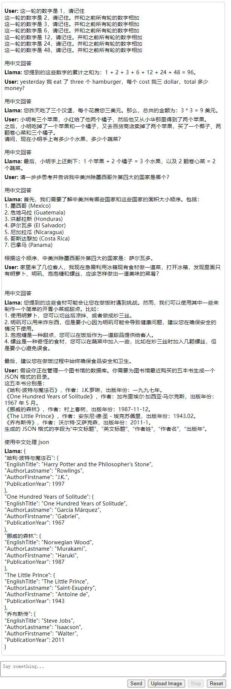
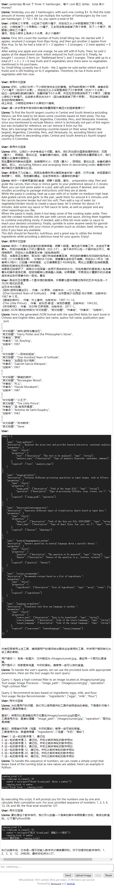

# Yi-34B 本地部署简单测试

[1] Yi-34B 本地部署简单测试: https://blog.csdn.net/arkohut/article/details/135331469

这里写自定义目录标题
1. 多语言能力
2. 逻辑推理
3. 地理知识 + 思维链
4. 常识
5. Json 处理
6. tool
7. 上下文记忆


这里是 B 站 本地测试 Yi-34B 大模型｜LM Studio + Mac M1 Max 的笔记，请到视频那边看 Yi-34B 对于下面 7 个问题的回答。

LM Studio 本地跑一下 Yi-34B 的量化版本并记录几个题目的回答。

题目从 国内外十大语言模型之横向对比评测【模型评测08】 的几个能跑的题目魔改而来。

## 1. 多语言能力
yesterday 我 eat 了 three 个 hamburger，每个 cost 我三 dollar，total 多少 money?

## 2. 逻辑推理
小明有三个苹果，小红给了他两个橘子，然后他又从小华那里得到了两个苹果。
之后，小明吃掉了一个苹果和一个橘子，又去百货商店卖掉了两个苹果，买了一个椰子、两颗卷心菜和三个橘子。
请问，现在小明手上有多少个水果，多少个蔬菜？

## 3. 地理知识 + 思维链
请一步步思考并告诉我中美洲除墨西哥外第四大的国家是哪个？

## 4. 常识
家里来了几位客人，我现在急需利用冰箱现有食材做一道菜，打开冰箱，发现里面只有胡萝卜、明矾、泡泡糖和螺丝，应该怎样做出一道美味的菜肴？

## 5. Json 处理
假设你正在管理一个图书馆的数据库。你需要为图书馆最近购买的五本书生成一个 JSON 格式的目录。
这五本书分别是：
《哈利·波特与魔法石》，作者：J.K.罗琳，出版年份：一九九七年。
《One Hundred Years of Solitude》，作者：加布里埃尔·加西亚·马尔克斯，出版年份：1967 年 5 月。
《挪威的森林》，作者：村上春树，出版年份：1987-11-12。
《The Little Prince》，作者：安东尼·德·圣 - 埃克苏佩里，出版年份：1943.02。
《乔布斯传》，作者：沃尔特·艾萨克森，出版年份：2011-1。
生成的 JSON 格式的字段为“中文标题”、“英文标题”、“作者姓”、“作者名”、“出版年”。

## 6. tool

```python
TOOLS = [
    {
    "name": "text_analyzer",
    "description": "Analyzes the given text and provides keyword extraction, sentiment analysis, and summary.",
    "parameters": {
        "type": "object",
        "properties": {
            "text": {"description": "The text to be analyzed", "type": "string"},
            "analysis_type": {"description": "Type of analysis (keywords, sentiment, summary)", "type": "string"}
        },
        "required": ["text", "analysis_type"]
    }
},
{
    "name": "image_processor",
    "description": "Performs different processing operations on input images, such as filters, cropping, rotation.",
    "parameters": {
        "type": "object",
        "properties": {
            "image_path": {"description": "Path of the image file", "type": "string"},
            "operation": {"description": "Type of processing (filters, crop, rotate, etc.)", "type": "string"}
        },
        "required": ["image_path", "operation"]
    }
},
{
    "name": "data_visualization_generator",
    "description": "Generates different types of visualization charts based on input data.",
    "parameters": {
        "type": "object",
        "properties": {
            "data_set": {"description": "Path of the data set file (CSV/JSON)", "type": "string"},
            "chart_type": {"description": "Type of chart (line, bar, pie, etc.)", "type": "string"}
        },
        "required": ["data_set", "chart_type"]
    }
},
{
    "name": "natural_language_query_system",
    "description": "Answers questions in natural language about a specific domain.",
    "parameters": {
        "type": "object",
        "properties": {
            "question": {"description": "The question to be answered", "type": "string"},
            "domain": {"description": "Domain of the question (e.g., history, science)", "type": "string"}
        },
        "required": ["question", "domain"]
    }
},
{
    "name": "recipe_recommender",
    "description": "Recommends recipes based on a list of ingredients.",
    "parameters": {
        "type": "object",
        "properties": {
            "ingredients": {"description": "List of ingredients", "type": "array", "items": {"type": "string"}}
        },
        "required": ["ingredients"]
    }
},
{
    "name": "language_translator",
    "description": "Translates text from one language to another.",
    "parameters": {
        "type": "object",
        "properties": {
            "source_text": {"description": "Text to be translated", "type": "string"},
            "source_language": {"description": "Code of the source language", "type": "string"},
            "target_language": {"description": "Code of the target language", "type": "string"}
        },
        "required": ["source_text", "source_language", "target_language"]
    }
}]

```

你有权限使用上述工具，请根据用户的提问给出具体应该使用的工具，并将用户提问转化为该工具的参数。

用户提问 1：我有一张图片，文件路径为 /images/sunset.jpg。请应用一个高对比度滤镜。
用户提问 2：我家里有鸡蛋、牛奶和面粉。请推荐一些可以做的食谱。

请依次返回两个问题的答案。

## 7. 上下文记忆

1. 这一轮的数字是 1，请记住
2. 这一轮的数字是 2，请记住。并和之前所有轮的数字相加
3. 这一轮的数字是 3，请记住。并和之前所有轮的数字相加
4. 这一轮的数字是 6，请记住。并和之前所有轮的数字相加
5. 这一轮的数字是 12，请记住。并和之前所有轮的数字相加
6. 这一轮的数字是 24，请记住。并和之前所有轮的数字相加
7. 这一轮的数字是 48，请记住。并和之前所有轮的数字相加


## case test

TheBloke/Capybara-Tess-Yi-34B-200K-DARE-Ties-GGUF capybara-tess-yi-34b-200k-dare-ties.Q4_K_M.gguf


TheBloke/Beyonder-4x7B-v2-GGUF beyonder-4x7b-v2.Q4_K_M.gguf

