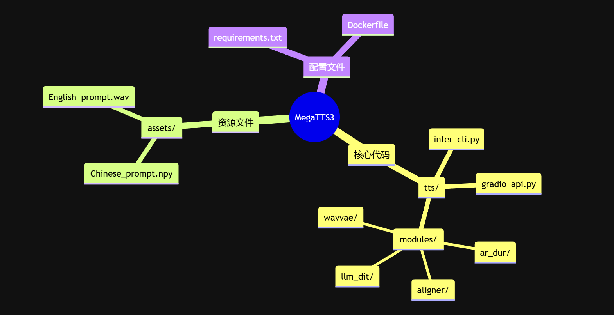

# MegaTTS3
最完整MegaTTS3语音合成指南：3分钟搭建本地AI语音克隆系统
https://blog.csdn.net/gitblog_00824/article/details/151892099

https://github.com/bytedance/MegaTTS3
https://gitcode.com/gh_mirrors/me/MegaTTS3

wavvae encoder: model_only_last.ckpt
https://huggingface.co/mrfakename/MegaTTS3-VoiceCloning/tree/main
https://hf-mirror.com/mrfakename/MegaTTS3-VoiceCloning/tree/main

## 二、零代码体验方案（3种选择）

### 方案1：HuggingFace在线Demo（推荐新手）

访问MegaTTS3官方Demo页面
上传参考音频（支持WAV格式，≤28秒）
输入文本内容（支持中英双语混合）
调整生成参数：
infer_timestep：扩散步数（默认32，值越大质量越高但速度越慢）
p_w：清晰度权重（默认1.4，范围0.5-2.0）
t_w：相似度权重（默认3.0，范围1.0-5.0）
点击"生成"按钮，等待3-10秒获取结果

###  方案2：Docker快速启动（适合本地体验）

```bash
# 克隆代码仓库
git clone https://gitcode.com/gh_mirrors/me/MegaTTS3
cd MegaTTS3
 
# 构建Docker镜像
docker build -t megatts3:latest .
 
# 启动服务（映射7860端口）
docker run -p 7860:7860 megatts3:latest
```

### 方案3：源码启动Web界面

```bash
# 克隆代码仓库
git clone https://gitcode.com/gh_mirrors/me/MegaTTS3
cd MegaTTS3
 
# 创建虚拟环境
python -m venv venv
source venv/bin/activate  # Linux/Mac
venv\Scripts\activate     # Windows
 
# 安装依赖
pip install -r requirements.txt
 
# 启动Gradio界面
python tts/gradio_api.py
```

## 三、本地化部署全流程（适合开发者）

### 3.1 环境准备

```bash
# 检查Python版本（需3.8-3.10）
python --version
 
# 安装PyTorch（根据CUDA版本选择）
pip3 install torch torchvision torchaudio --index-url https://download.pytorch.org/whl/cu118
```

### 3.2 项目结构解析


关键模块功能：

- llm_dit/：扩散Transformer核心实现
- wavvae/：声码器模块，负责将梅尔频谱转为波形
- ar_dur/：时长预测器，控制语音节奏
- aligner/：文本-语音对齐模块

### 3.3 命令行工具使用

基础用法：
```bash
python tts/infer_cli.py \
  --audio_path assets/Chinese_prompt.wav \
  --text "你好，这是MegaTTS3的语音合成演示" \
  --output_path output.wav \
  --timestep 32 \
  --p_w 1.4 \
  --t_w 3.0
```


批量处理：

```bash
# 创建输入文件列表 input.txt
# 格式：音频路径|文本内容|输出路径
python tts/infer_cli.py --batch_file input.txt
```