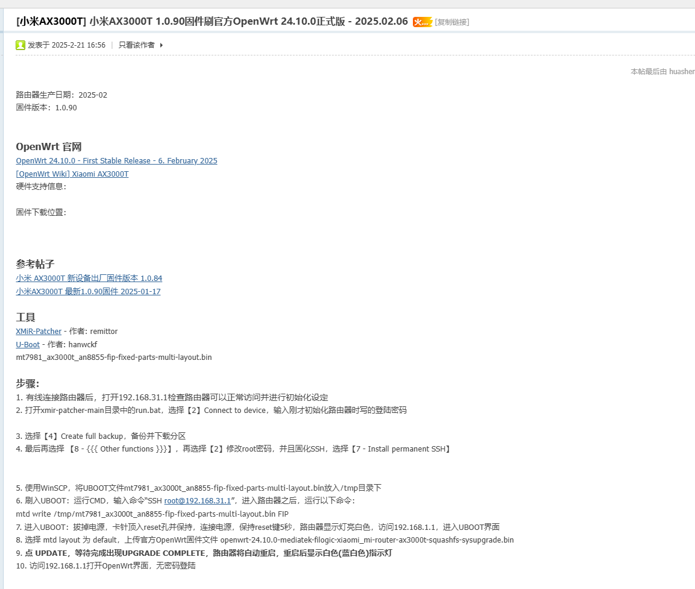

# openwrt

红米 AX3000 : https://www.right.com.cn/forum/thread-8417892-1-1.html


小米路由器 4A千兆版： https://www.bilibili.com/video/BV1G94y1g7gG/?spm_id_from=333.337.search-card.all.click&vd_source=415935dde407cbb19457f2073c5c70d4
https://blog.mnxy.eu.org/posts/lyq

## 1 OpenWrt 官网
  OpenWrt 24.10.0 - First Stable Release - 6. February 2025: https://openwrt.org/releases/24.10/notes-24.10.0
  [OpenWrt Wiki] Xiaomi AX3000T : https://openwrt.org/inbox/toh/xiaomi/ax3000t

## 2 参考帖子
小米 AX3000T 新设备出厂固件版本 1.0.84 : https://www.right.com.cn/forum/thread-8395187-1-1.html
小米AX3000T 最新1.0.90固件 2025-01-17 : https://www.right.com.cn/forum/thread-8414596-1-1.html

## 3 工具
XMiR-Patcher - 作者: remittor: https://github.com/openwrt-xiaomi/xmir-patcher
U-Boot - 作者: hanwckf : https://github.com/hanwckf/bl-mt798x/
mt7981_ax3000t_an8855-fip-fixed-parts-multi-layout.bin

## 4 步骤：
1. 有线连接路由器后，打开192.168.31.1检查路由器可以正常访问并进行初始化设定
2. 打开 xmir-patcher-main 目录中的 run.bat，选择【2】Connect to device，输入刚才初始化路由器时写的登陆密码

3. 选择【4】Create full backup，备份并下载分区
4. 最后再选择 【8 - {{{ Other functions }}}】，再选择【2】修改root密码，并且固化SSH，选择【7 - Install permanent SSH】


5. 使用 WinSCP，将 UBOOT 文件 mt7981_ax3000t_an8855-fip-fixed-parts-multi-layout.bin 放入/tmp目录下
6. 刷入 UBOOT：运行 CMD，输入命令“SSH root@192.168.31.1”，进入路由器之后，运行以下命令：
mtd write /tmp/mt7981_ax3000t_an8855-fip-fixed-parts-multi-layout.bin FIP
7. 进入 UBOOT：拔掉电源，卡针顶入 reset 孔并保持，连接电源，保持 reset 键 5 秒，路由器显示灯亮白色，电脑 ip 改为192.168.1.2， 访问 192.168.1.1，进入 UBOOT 界面
8. 选择 mtd layout 为 default，上传官方 OpenWrt 固件文件 
openwrt-24.10.0-mediatek-filogic-xiaomi_mi-router-ax3000t-squashfs-sysupgrade.bin
https://firmware-selector.openwrt.org/?version=24.10.0&target=mediatek%2Ffilogic&id=xiaomi_mi-router-ax3000t
9. 点 UPDATE，等待完成出现 UPGRADE COMPLETE，路由器将自动重启，重启后显示白色(蓝白色)指示灯
10. 访问192.168.1.1打开 OpenWrt 界面，无密码登陆

## 其他

### ip/dns 泄露检测
https://ipleak.net/
https://whoer.net/
https://iplark.com/

cloudflare dns
1.1.1.1 

google dns
8.8.8.8
114.114.114.114

阿里公共 DNS
223.5.5.5
223.6.6.6

### 测速
https://fast.com/
https://speed.cloudflare.com/

### 机场
https://www.youtube.com/watch?v=S2l_0g4EOHk&t=644s

FlowerCloud : 
加菲猫: https://cloud.bbloli.com/ 

红杏机场: https://hongxindl.com 

1，火烧云机场（稳定中转，5折注册专链）： https://hsy88.org/#/register?code=EXtkaPPN
5折券 请进电报群领取：https://t.me/angeworld2024_2

2，小牛机场（真IEPL专线，7折注册专链）：https://xiaoniuyun.cc/register/cn?code=K6bM17XK
7折券 请注册后进“优惠中心”领取专属折扣。

3，硅谷云机场（真IEPL专线+UDP游戏加速），7折码：agsj-ggy  
7折注册专链：https://svcloud.one/#/register?code=L...

4，猫耳机场（稳定中转）7折码：agsjzk  
7折注册专链： https://ht.idsduf.com/#/register?code...

5，快猫机场（IPLC专线）7折码：agsjkm  
7折注册专链：https://www.kuaimao2.club/register?co...

6，牛逼机场（极致性价比）9折码：agsjnb  
9折注册专链：https://6.66jc.top/#/login?code=lcUhwGNe

7，Radial VPN（5折注册专链）：https://raajto.cn/?invite=ggqwtu  
5折券 请进电报群领取：https://t.me/angeworld2024_2


### 主题
https://github.com/jerrykuku/luci-theme-argon/blob/master/README_ZH.md

```bash
# 在官方和 ImmortalWrt 上安装
opkg install luci-compat
opkg install luci-lib-ipkg
wget --no-check-certificate https://github.com/jerrykuku/luci-theme-argon/releases/download/v2.3.2/luci-theme-argon_2.3.2-r20250207_all.ipk
opkg install luci-theme-argon*.ipk

# 安装 luci-app-argon-config
wget --no-check-certificate https://github.com/jerrykuku/luci-app-argon-config/releases/download/v0.9/luci-app-argon-config_0.9_all.ipk
opkg install luci-app-argon-config*.ipk
```

### 安装 OpenClash
https://github.com/vernesong/OpenClash/

OpenWrt 安装使用 OpenClash
https://blog.hellowood.dev/posts/openwrt-%E5%AE%89%E8%A3%85%E4%BD%BF%E7%94%A8-openclash/

```bash
export http_proxy="http://192.168.10.199:7890" 
export https_proxy="http://192.168.10.199:7890" 

opkg list-installed |find iptables

# 1. OpenClash 依赖的是 dnsmasq-full，所以需要移除默认的dnsmasq，否则会导致 OpenClash 安装失败
opkg remove dnsmasq && opkg install dnsmasq-full
opkg remove ruby ruby-yaml && opkg install ruby ruby-yaml 

# 2. 下载并安装 OpenClash
# 可以在 OpenClash 仓库的 Release 页面选择对应的版本进行下载
opkg update
# iptables
# opkg install bash iptables dnsmasq-full curl ca-bundle ipset ip-full iptables-mod-tproxy iptables-mod-extra ruby ruby-yaml kmod-tun kmod-inet-diag unzip luci-compat luci luci-base
# nftables
# opkg install bash dnsmasq-full curl ca-bundle ip-full ruby ruby-yaml kmod-tun kmod-inet-diag unzip kmod-nft-tproxy luci-compat luci luci-base
# wget https://github.com/vernesong/OpenClash/releases/download/v0.45.35-beta/luci-app-openclash_0.45.35-beta_all.ipk -O openclash.ipk
wget https://github.com/vernesong/OpenClash/releases/download/v0.46.079/luci-app-openclash_0.46.079_all.ipk -O openclash.ipk
opkg install openclash.ipk

# 3. 添加 luci-compact 并重启，否则会提示进入 luci 页面错误
opkg install luci luci-base luci-compat
reboot
# 待重启完成后重新登录控制台，可以在服务菜单中看到 OpenClash
```

### 手动安装 openclash core
```bash
# 进入内核安装目录

cd /etc/openclash/core/ 

# 下载内核安装包

wget https://github.com/vernesong/OpenClash/releases/download/Clash/clash-linux-armv8.tar.gz

# 解压内核安装包

tar -zxvf clash-linux-armv8.tar.gz

# 给予最高权限

chmod 777 clash

```
### redir-host / fakeip / realip

### passwall

### singbox

### DDNS

### SmartDNS